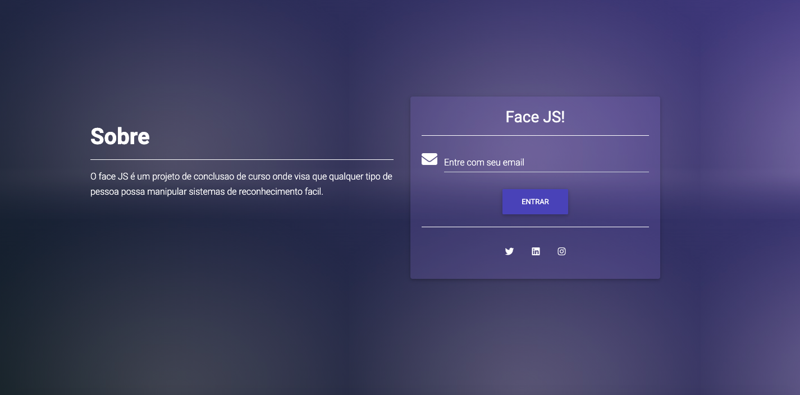
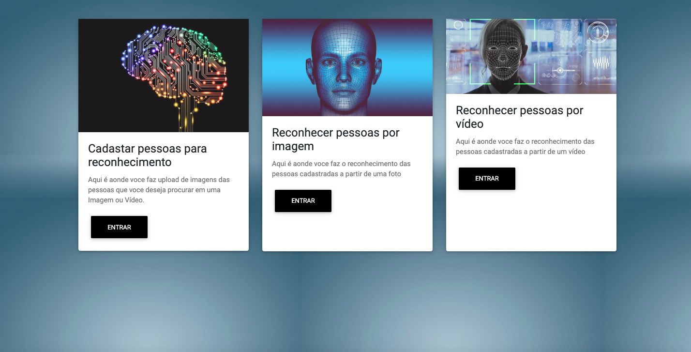

<h3 align="center">
  Face JS
</h3>

Este projeto foi criado para meu Trbalho de conclusão de curso na Universidade de Vila Velho no ano de 2019. Tratase de uma aplicação web para reconhecimento de pessoas em imagens e vídeos. Clone os projetos de backend e frontend e confiram! 

<blockquote align="center">“Não espere para plantar, apenas tenha paciência para colher”!(Rocketseat, 2020)</blockquote>

<h1 align="center">
  
</h1>

<h1 align="center">
  
</h1>

Qualquer dúvida só me comunicar =] (tiagohenriquequeiroz@gmail.com)
